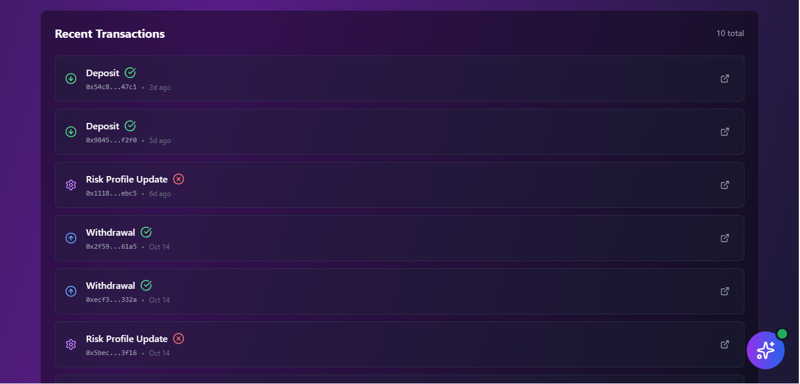

# sBTC Guardian Vaults 🛡️

### _AI-Powered Bitcoin DeFi Protection_

> Intelligent portfolio management for sBTC with GPT-4 powered risk analysis and automated rebalancing


---

## 🌟 Overview

sBTC Guardian Vaults is the first AI-powered vault system for Bitcoin on Stacks, combining institutional-grade DeFi strategies with GPT-4 intelligence to protect and grow your sBTC holdings.

**Key Innovation:** Natural language AI advisor that monitors market conditions 24/7 and provides personalized recommendations.

---

## 🎯 Live Demo

- **App:** https://sbtc-guardian-vaults.vercel.app
- **API:** https://sbtc-guardian-vaults-production.up.railway.app
- **Contract:** ST2X1GBHA2WJXREWP231EEQXZ1GDYZEEXYRAD1PA8.sbtc-vault-guardian

---

## 🎥 Demo Video

Watch the full demo showcasing AI-powered portfolio management:

[](https://youtu.be/Eko0Mlq4dbU)

**[▶️ Watch on YouTube](https://youtu.be/Eko0Mlq4dbU)**

---

## ✨ Features

### 🤖 AI-Powered Intelligence

- **GPT-4 Risk Analysis** - Real-time portfolio assessment
- **Natural Language Chat** - Ask questions in plain English
- **Smart Recommendations** - Personalized advice based on your risk profile
- **Market Sentiment Analysis** - AI-driven market outlook

### 📊 DeFi Integration

- **Multi-Protocol** - Diversify across Zest, Velar, and StackSwap
- **Auto-Rebalancing** - Maintain optimal allocation (coming soon)
- **Risk Profiles** - Conservative, Moderate, and Aggressive strategies
- **Real-time APY** - Live yields from DeFi protocols

### 📈 Portfolio Management

- **Live Bitcoin Prices** - Real-time data from CoinGecko
- **Performance Charts** - Track your portfolio growth
- **APY History** - Historical yield tracking
- **Transaction History** - Complete audit trail

### 🔐 Security & Trust

- **Non-Custodial** - You always control your keys
- **Stacks Blockchain** - Secured by Bitcoin
- **Smart Contracts** - Deployed on Stacks Testnet
- **Open Source** - Transparent and auditable

---

## 📸 Screenshots

### Homepage & AI Chat

*AI-powered portfolio advisor ready to answer your questions*

### AI Conversation

*GPT-4 providing personalized investment advice*

### Dashboard

*Portfolio overview with real-time data*

### Analytics

*Performance tracking and APY history*

### Transaction History

*Complete audit trail of all vault activities*

---

## 🏗️ Tech Stack

**Frontend:**

- React 19 + Vite
- TailwindCSS
- Chart.js for visualizations
- Stacks Connect for wallet integration

**Backend:**

- Node.js + Express
- OpenAI GPT-4 API
- CoinGecko API for price data
- Railway deployment

**Blockchain:**

- Stacks Blockchain
- Clarity Smart Contracts
- sBTC Integration

---

## 🚀 Quick Start

### Prerequisites

- Node.js 18+
- Leather Wallet (for Stacks)
- OpenAI API Key (optional, for AI features)

### Installation

```bash
# Clone the repository
git clone https://github.com/mattglory/sbtc-guardian-vaults.git
cd sbtc-guardian-vaults

# Install backend dependencies
cd backend
npm install
cp .env.example .env
# Edit .env with your API keys

# Install frontend dependencies
cd ../frontend
npm install

# Run development servers
# Terminal 1 (Backend)
cd backend
npm run dev

# Terminal 2 (Frontend)
cd frontend
npm run dev
```

Visit http://localhost:5173

---

## 🎨 Screenshots

### Main Dashboard


### AI Chat Advisor


### Portfolio Analytics


---

## 📱 Usage

1. **Connect Wallet** - Use Leather wallet to connect
2. **Choose Risk Profile** - Select Conservative, Moderate, or Aggressive
3. **Deposit sBTC** - Transfer sBTC to your vault
4. **Monitor Performance** - Track APY, risk scores, and returns
5. **Chat with AI** - Ask questions about your portfolio anytime

---

## 🛠️ Development

### Smart Contracts

```bash
# Check contracts
clarinet check

# Run tests
clarinet test

# Deploy to testnet
clarinet deploy --testnet
```

### API Endpoints

- `GET /api/market/btc-price` - Current Bitcoin price
- `GET /api/protocols` - DeFi protocol data
- `POST /api/ai/analyze-risk` - AI risk analysis
- `POST /api/ai/chat` - Chat with AI advisor
- `GET /api/analytics/portfolio/:address` - Portfolio data

---

## 📊 Project Stats

- **Build Time:** 48 hours from zero to production
- **Lines of Code:** 10,000+
- **API Endpoints:** 20+
- **Smart Contracts:** Deployed on Stacks Testnet
- **Status:** Production-ready MVP

---

## 🎯 Roadmap

### Phase 1 - MVP ✅ (Completed)

- [x] Smart contract deployment
- [x] Frontend with wallet integration
- [x] Backend API
- [x] GPT-4 AI integration
- [x] Real-time market data
- [x] Portfolio analytics

### Phase 2 - Mainnet Launch 🚀 (Q1 2026)

- [ ] Security audit
- [ ] Mainnet deployment
- [ ] Auto-rebalancing implementation
- [ ] Advanced AI features
- [ ] Mobile app

### Phase 3 - Scale 📈 (Q2 2026)

- [ ] Additional DeFi protocols
- [ ] Advanced risk models
- [ ] Institutional features
- [ ] DAO governance

---

## 🚀 What's Next

Interested in the future of sBTC Guardian Vaults? We're planning exciting developments:

**Mainnet Launch** - Professional security audit and production deployment
**Advanced Features** - Auto-rebalancing and enhanced AI capabilities  
**Mobile Apps** - Native iOS and Android applications
**Community Growth** - Building the Bitcoin DeFi ecosystem

**Want to contribute or collaborate?** Contact: mattglory14@gmail.com

---

## 🤝 Contributing

Contributions welcome! Please feel free to submit a Pull Request.

1. Fork the repository
2. Create your feature branch (`git checkout -b feature/AmazingFeature`)
3. Commit your changes (`git commit -m 'Add some AmazingFeature'`)
4. Push to the branch (`git push origin feature/AmazingFeature`)
5. Open a Pull Request

---

## 📄 License

This project is licensed under the MIT License - see the [LICENSE](LICENSE) file for details.

---

## 🙏 Acknowledgments

- Built on the Stacks blockchain
- Powered by OpenAI GPT-4
- Price data from CoinGecko
- DeFi protocols: Zest, Velar, StackSwap
- Special thanks to the Stacks community

---

## 📧 Contact

**Developer:** Matt Glory  
**Email:** mattglory14@gmail.com  
**GitHub:** [@mattglory](https://github.com/mattglory)  
**Project:** [sBTC Guardian Vaults](https://github.com/mattglory/sbtc-guardian-vaults)

---

## ⚠️ Disclaimer

This is experimental software. Currently deployed on Stacks Testnet. Use at your own risk. Not financial advice.

---

**Built with ❤️ for the Bitcoin ecosystem**

_Making Bitcoin DeFi accessible, intelligent, and secure_
